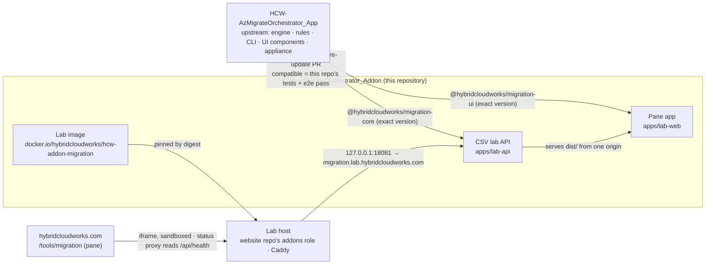

# Hybrid Cloud Works Migration Explorer

**The web-front edition of the Azure Migration Orchestrator — downstream of the appliance.**

[](https://github.com/saulpatinojr/HCW-AzMigrateOrchestrator_Addon/actions/workflows/ci.yml)
[](https://github.com/saulpatinojr/HCW-AzMigrateOrchestrator_Addon/actions/workflows/security.yml)
[](https://github.com/saulpatinojr/HCW-AzMigrateOrchestrator_Addon/actions/workflows/core-update.yml)
[](https://github.com/saulpatinojr/HCW-AzMigrateOrchestrator_App/releases/tag/v0.2.1)
[](docs/adr/ADR-0029-node-26-runtime-floor.md)
[](https://hub.docker.com/r/hybridcloudworks/hcw-addon-migration)
[](LICENSE)

Upload the `resources.csv` exported from the Azure portal and see how every resource would move — with evidence, confidence,
prerequisites, risks, and generated Terraform, scripts and runbooks. The explorer **never touches Azure, never asks for
credentials and cannot execute anything**; inventories are processed in memory only and expire.

This repository is the slim, downstream edition of the appliance in
[`HCW-AzMigrateOrchestrator_App`](https://github.com/saulpatinojr/HCW-AzMigrateOrchestrator_App): the **CSV lab API**, the
**pane app** the website frames at `/tools/migration`, the browser e2e, the lab image and the **website-integration docs**. The engine, rule corpus, CLI and explorer components live upstream and arrive here as the
published packages `@hybridcloudworks/migration-core` and `@hybridcloudworks/migration-ui`.

> **Status:** reference implementation, not production. Limitations are recorded in [`VALIDATION.md`](VALIDATION.md).

## How the two repositories relate



**Updates flow downstream, when compatible.** `.github/workflows/core-update.yml` watches upstream releases (every six
hours and on demand). For each new release it builds it, installs it here, runs this repository's unit tests and the
Playwright suite, and opens a pull request bumping the pinned release, labelled `compatible` or `needs-adaptation`. A
compatible PR auto-merges only if the repository variable `CORE_AUTOMERGE` is `true`. The engine, rules and UI components
are never edited here; `tests/security/edition-boundary.test.mjs` fails the build if anything here could reach Azure.
Decision records: [ADR-0028](docs/adr/ADR-0028-appliance-upstream-web-front-downstream.md), [ADR-0008](docs/adr/ADR-0008-hard-edition-boundary-the-demo-cannot-construct-an-azure-provider.md).

## Connecting the website

The site frames this AddOn as a sandboxed pane; nothing from here is installed into the site. The integration surface:

| Concern | Where it is defined |
|---|---|
| Site route `/tools/migration`, AddOn origin `https://migration.lab.hybridcloudworks.com`, catalogue row, status-proxy projection, pane protocol (`loading → ready → working → ready`, `unavailable`, `navigate`), sandbox and capabilities the site grants (`navigate`, `downloads`), env table, what a release hands the site (image digest + version) | [`docs/website-integration/integration-guide.md`](docs/website-integration/integration-guide.md), [`routes.md`](docs/website-integration/routes.md) |
| The API contract behind the pane (`/api/health` envelope, `/api/assessments`, bundle and file downloads, delete, 429/503) | [`docs/api/openapi.yaml`](docs/api/openapi.yaml) |
| Hosting on the website's lab host through its `addons` Ansible role: image by digest, loopback port 18081, hardening, env, the vault key for the verification secret, owner steps, health, logs, rollback | [`docs/deployment/lab-host.md`](docs/deployment/lab-host.md), [`docs/security/threat-model.md`](docs/security/threat-model.md) |

Only public configuration crosses the boundary: the AddOn origin and the verification *site* key. The verification *secret*
lives in the lab host's vault (`vault_addon_migration_turnstile_secret`), never in the site bundle, Git or Terraform state.

## Quick start

Requires Node 26. Until the packages are on npm, the upstream product is a sibling checkout at the pinned release:

```bash
npm run app:bootstrap        # clones ../HCW-AzMigrateOrchestrator_App at APP_REF, builds it and assembles its packages
npm ci && npm test           # API, contract, boundary, manifest and no-secrets tests
npm run build                # API (tsc) + pane (vite → apps/lab-web/dist)
AMO_ALLOW_NO_TURNSTILE=1 npm run lab:api   # http://127.0.0.1:8080 — the pane and its API, no verification locally
npm run e2e                  # Playwright: the pane through a host page with the site's sandbox, siteverify mocked
```

PowerShell: `bash scripts/bootstrap-app.sh; npm ci; npm test; npm run build; $env:AMO_ALLOW_NO_TURNSTILE="1"; npm run lab:api`

Container image, built from the **parent** directory holding both checkouts:
`docker build -f HCW-AzMigrateOrchestrator_Addon/infrastructure/docker/Dockerfile.lab .` (see `docker-compose.yml`).

## Repository map

| Path | What |
|---|---|
| `apps/lab-api` | The CSV lab API: in-memory assessments with owner tokens and TTL, human verification (fail closed), per-client rate limit and concurrency cap, framing headers, the AddOn health envelope, serves the built pane |
| `apps/lab-web` | The pane app the site frames: `@hybridcloudworks/migration-ui` against the same origin, the verification widget, the `hcw-addon` pane protocol |
| `tests/e2e` · `tests/security` · `tests/contract` | Browser journey through the pane and through a sandboxed host page (exact message sequence, headers, 403 without a token, no password fields, no partner names); edition boundary; two-way OpenAPI ↔ routes |
| [`infrastructure/`](infrastructure/README.md) | Lab Dockerfile (two-tree build, pane included), Coder template and workspace image, monitoring notes; retired Terraform |
| [`docs/`](docs/README.md) | Website integration (pane model), lab-host deployment and operations, demo user guide, threat model, OpenAPI, partner one-pagers |

## Releases and artifacts

`APP_REF` in `.github/workflows` is the upstream release this edition is built against; it changes only through a reviewed
pull request, normally the one `core-update` opens. A `v*` tag here publishes the lab image to
`docker.io/hybridcloudworks/hcw-addon-migration` after a vulnerability scan, with provenance and SBOM, through the Docker OIDC
connection (no registry secrets); the website pins the digest the run prints. `X-Addon-Version` and `/api/health.version`
report the version released. Tags `v0.1.0`–`v0.1.3` predate the flip to this edition and are historical.

## Contributing, security, license

[`CONTRIBUTING.md`](CONTRIBUTING.md) · [`SECURITY.md`](SECURITY.md) · [`CODE_OF_CONDUCT.md`](CODE_OF_CONDUCT.md) ·
MIT ([`LICENSE`](LICENSE), [`NOTICE`](NOTICE)). Coding-agent guidance: [`AGENTS.md`](AGENTS.md), [`CLAUDE.md`](CLAUDE.md).
