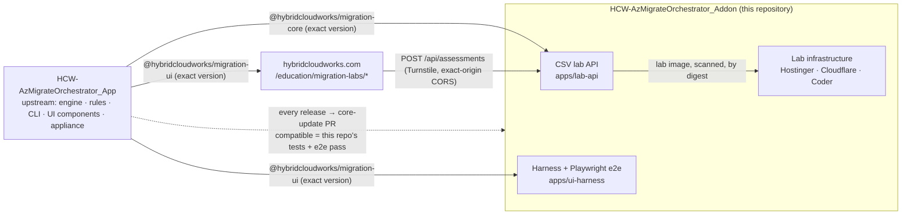

# Hybrid Cloud Works Migration Explorer

**The web-front edition of the Azure Migration Orchestrator — downstream of the appliance.**

[](https://github.com/saulpatinojr/HCW-AzMigrateOrchestrator_Addon/actions/workflows/ci.yml)
[](https://github.com/saulpatinojr/HCW-AzMigrateOrchestrator_Addon/actions/workflows/security.yml)
[](https://github.com/saulpatinojr/HCW-AzMigrateOrchestrator_Addon/actions/workflows/core-update.yml)
[](https://github.com/saulpatinojr/HCW-AzMigrateOrchestrator_App/releases/tag/v0.2.1)
[](docs/adr/ADR-0029-node-26-runtime-floor.md)
[](https://github.com/saulpatinojr/HCW-AzMigrateOrchestrator_Addon/pkgs/container/azure-migration-orchestrator-lab)
[](LICENSE)

Upload the `resources.csv` exported from the Azure portal and see how every resource would move — with evidence, confidence,
prerequisites, risks, and generated Terraform, scripts and runbooks. The explorer **never touches Azure, never asks for
credentials and cannot execute anything**; inventories are processed in memory only and expire.

This repository is the slim, downstream edition of the appliance in
[`HCW-AzMigrateOrchestrator_App`](https://github.com/saulpatinojr/HCW-AzMigrateOrchestrator_App): the **CSV lab API**, the
static harness and browser e2e, the lab infrastructure (Hostinger VPS, Cloudflare edge, Coder guided lab) and the
**website-integration docs**. The engine, rule corpus, CLI and explorer components live upstream and arrive here as the
published packages `@hybridcloudworks/migration-core` and `@hybridcloudworks/migration-ui`.

> **Status:** reference implementation, not production. Limitations are recorded in [`VALIDATION.md`](VALIDATION.md).

## How the two repositories relate



**Updates flow downstream, when compatible.** `.github/workflows/core-update.yml` watches upstream releases (every six
hours and on demand). For each new release it builds it, installs it here, runs this repository's unit tests and the
Playwright suite, and opens a pull request bumping the pinned release, labelled `compatible` or `needs-adaptation`. A
compatible PR auto-merges only if the repository variable `CORE_AUTOMERGE` is `true`. The engine, rules and UI components
are never edited here; `tests/security/edition-boundary.test.mjs` fails the build if anything here could reach Azure.
Decision records: [ADR-0028](docs/adr/ADR-0028-appliance-upstream-web-front-downstream.md), [ADR-0008](docs/adr/ADR-0008-hard-edition-boundary-the-demo-cannot-construct-an-azure-provider.md).

## Connecting the website

For the hybridcloudworks.com repository review, the integration surface is small and fully documented:

| Concern | Where it is defined |
|---|---|
| The explorer component and how the site mounts it as a lazy client-only island, Tailwind source scanning, Turnstile token hand-off | [`docs/website-integration/integration-guide.md`](docs/website-integration/integration-guide.md) |
| Routes to add to the site's route inventory (`/education/migration-labs`, `…/azure-resource-assessment`, `…/start`) | [`docs/website-integration/routes.md`](docs/website-integration/routes.md) |
| The lab API contract the island calls (`/api/health`, `/api/assessments`, bundle and file downloads, delete) | [`docs/api/openapi.yaml`](docs/api/openapi.yaml) |
| Lab API hosting on the existing Hostinger VPS behind the host's Caddy, loopback-only port, exact-origin CORS for `https://hybridcloudworks.com` and `https://www.hybridcloudworks.com`, Turnstile on uploads, 5 MB / 5,000-row limits, 120-minute TTL | [`docs/deployment/vps.md`](docs/deployment/vps.md), [`docs/security/threat-model.md`](docs/security/threat-model.md), upstream [`WORKING-PLAN.md`](https://github.com/saulpatinojr/HCW-AzMigrateOrchestrator_App/blob/main/WORKING-PLAN.md) Phase 3 |

Two facts the site team should plan around. The UI package is installed from npm at an exact version, and that publication
is pending the owner's one-time registry bootstrap (upstream `docs/release/npm-publishing.md`); until then the site cannot
install it. And only public configuration crosses the boundary: the API URL and the Turnstile *site* key are public; the
Turnstile *secret* lives in the VPS host environment, never in the site bundle, Git or Terraform state.

## Quick start

Requires Node 26. Until the packages are on npm, the upstream product is a sibling checkout at the pinned release:

```bash
npm run app:bootstrap        # clones ../HCW-AzMigrateOrchestrator_App at APP_REF, builds it and assembles its packages
npm ci && npm test           # 15 tests incl. the edition boundary against the installed core
npm run lab:api              # http://localhost:8080 — lab UI + API
npm run e2e                  # Playwright: explorer through the harness against the real lab API
```

PowerShell: `bash scripts/bootstrap-app.sh; npm ci; npm test; npm run lab:api`

Container image, built from the **parent** directory holding both checkouts:
`docker build -f HCW-AzMigrateOrchestrator_Addon/infrastructure/docker/Dockerfile.lab .` (see `docker-compose.yml`).

## Repository map

| Path | What |
|---|---|
| `apps/lab-api` | The CSV lab API: in-memory assessments with owner tokens and TTL, exact-origin CORS, Turnstile verification, bundle download, optional Coder hand-off |
| `apps/lab-web` · `apps/ui-harness` | Static demo page; Vite host that mounts `@hybridcloudworks/migration-ui` exactly as the website does |
| `tests/e2e` · `tests/security` · `tests/contract` | Browser journey (upload → questionnaire → results → detail → bundle → delete; asserts no password fields); edition boundary; OpenAPI ↔ routes |
| [`infrastructure/`](infrastructure/README.md) | Lab Dockerfile (two-tree build), Hostinger and Cloudflare Terraform, Coder template and workspace image, monitoring notes |
| [`docs/`](docs/README.md) | Website integration, partner one-pagers, lab deployment and operations, demo user guide, lab threat model, OpenAPI |

## Releases and artifacts

`APP_REF` in `.github/workflows` is the upstream release this edition is built against; it changes only through a reviewed
pull request, normally the one `core-update` opens. A `v*` tag here publishes the lab image to
`ghcr.io/saulpatinojr/azure-migration-orchestrator-lab` after a vulnerability scan, with provenance and SBOM; deploy by
digest. Tags `v0.1.0`–`v0.1.3` predate the flip to this edition and are historical.

## Contributing, security, license

[`CONTRIBUTING.md`](CONTRIBUTING.md) · [`SECURITY.md`](SECURITY.md) · [`CODE_OF_CONDUCT.md`](CODE_OF_CONDUCT.md) ·
MIT ([`LICENSE`](LICENSE), [`NOTICE`](NOTICE)). Coding-agent guidance: [`AGENTS.md`](AGENTS.md), [`CLAUDE.md`](CLAUDE.md).
